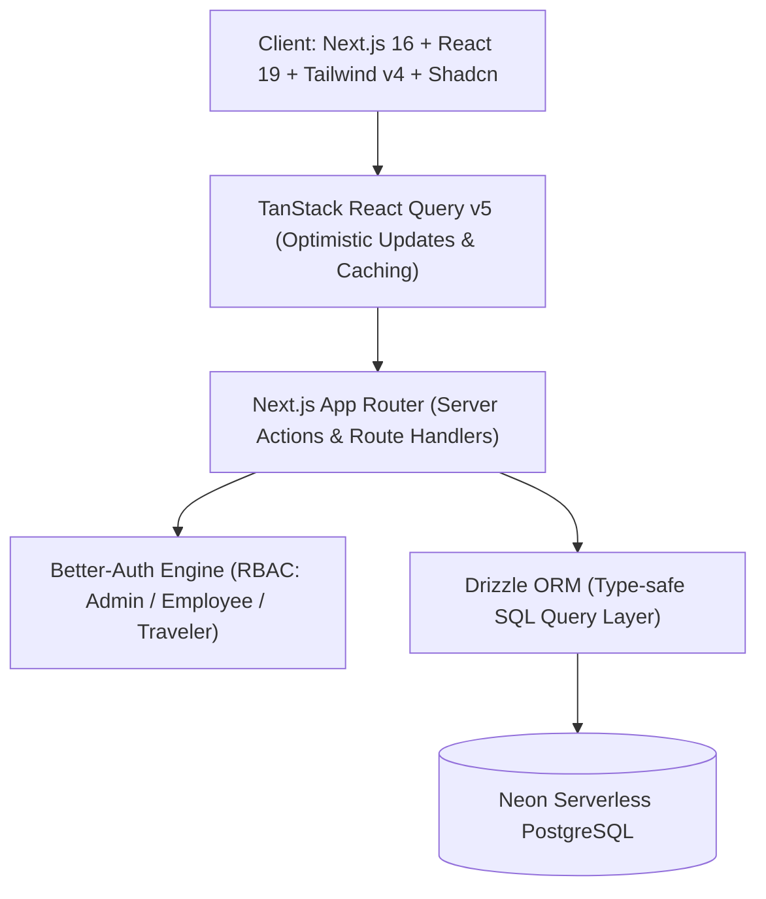

# 🌍 GlobeTrotter — Hackathon Presentation & Pitch Playbook

> **Project:** GlobeTrotter — Next-Generation Collaborative Travel & Itinerary Planning Platform  
> **Repository:** `odooxldce` (Odoo Hackathon)  
> **Tech Stack:** Next.js 16 (React 19), Drizzle ORM, Neon Serverless PostgreSQL, TanStack React Query v5, Better-Auth, Tailwind CSS v4, Shadcn UI, Dnd-Kit, Recharts  

---

## 📑 Table of Contents
1. [Presentation Strategy & Timing Breakdown](#-presentation-strategy--timing-breakdown)
2. [Slide Deck (Visuals, Key Points & Presenter Notes)](#-slide-deck)
3. [Complete Word-for-Word Speaking Script](#-complete-word-for-word-speaking-script)
4. [Step-by-Step Live Demo Choreography](#-step-by-step-live-demo-choreography)
5. [Comprehensive Feature-by-Feature Technical Breakdown](#-comprehensive-feature-by-feature-technical-breakdown)
6. [Judges Q&A Defense & Architecture Cheat Sheet](#-judges-qa-defense--architecture-cheat-sheet)

---

# ⏱ Presentation Strategy & Timing Breakdown

### Recommended Time Splits:
* **3-Minute Elevator Pitch:** 30s Problem/Hook → 1m 45s Live Demo → 30s Architecture → 15s Closing.
* **5-Minute Standard Pitch (Ideal):** 45s Problem & Vision → 2m 45s Live Feature Walkthrough → 1m Architecture & Technical Highlights → 30s Business Model & Conclusion.
* **10-Minute Deep Dive:** 1m 30s Problem & Market Need → 5m Full Feature Demo (Admin + Traveler + Collab) → 2m System Architecture & DB Design → 1m 30s Roadmap & Q&A.

---

# 🖥 Slide Deck

```
================================================================================
SLIDE 1: TITLE SLIDE
================================================================================
```
### ✈️ GlobeTrotter
**The Intelligent, Collaborative Travel Planning & Expense Management Platform**

* **Presenter:** Urvil Patel & Team
* **Event:** Odoo Hackathon 2026
* **Tagline:** *From Dream to Departure — Seamless Multi-City Planning, Real-Time Expense Tracking & Effortless Group Collaboration.*

---

```
================================================================================
SLIDE 2: THE PROBLEM (The Fragmented Travel Nightmare)
================================================================================
```
### 🛑 The Problem: Travel Planning is Broken & Disjointed

* 🤯 **Scattered Across 6+ Apps:** Spreadsheets for budgets, Google Maps for locations, WhatsApp for discussions, Notes for itineraries, Splitwise for expenses.
* 💸 **Budget Blindspots:** Travelers lose track of estimated vs. actual expenses across multiple currencies, resulting in budget overruns.
* 👥 **Collaboration Chaos:** Group trips suffer from "one person does all the work" or conflicting itineraries with zero role permissions.
* 🔒 **Walled Gardens:** Great itineraries are locked in private notes instead of being easily shareable or reusable by other travelers.

---

```
================================================================================
SLIDE 3: THE SOLUTION — GLOBETROTTER
================================================================================
```
### 🌟 The Solution: An All-In-One Modern Travel Operating System

```
┌───────────────────────────────────────────────────────────────────────────┐
│                           GLOBETROTTER PLATFORM                           │
├───────────────────┬───────────────────┬───────────────────┬───────────────┤
│  🧭 DISCOVER      │  🗺️ ITINERARY     │  💰 BUDGET        │  👥 COLLAB    │
│  Global Catalog   │  Multi-City Stops │  Category Caps    │  RBAC Roles   │
│  Curated Cities   │  Drag & Drop Days │  Live Expense Log │  Fork Trips   │
│  Rich Activities  │  Time Timelines   │  Multi-Currency   │  Public Share │
└───────────────────┴───────────────────┴───────────────────┴───────────────┘
```
1. **Interactive Itinerary Builder:** Multi-city routes, auto-generated day plans, drag-and-drop scheduling.
2. **Real-Time Budget & Expense Tracking:** Estimated vs. actual expense logs with visual category breakdown.
3. **Multiplayer Collaboration:** Role-Based Access Control (`Owner`, `Editor`, `Viewer`).
4. **Open-Source Itinerary Sharing:** 1-Click "Fork Trip" feature to clone public itineraries.
5. **Admin & Analytics Portal:** Live telemetry on users, trips, budget indices, and popular destinations.

---

```
================================================================================
SLIDE 4: SYSTEM ARCHITECTURE & TECH STACK
================================================================================
```
### ⚡ Architecture: Built for Speed, Scale & Seamless UX



* **Frontend:** Next.js 16 (App Router), React 19, Tailwind CSS v4, Shadcn UI / Radix UI, Dnd-Kit, Motion, Recharts.
* **Backend & API:** Next.js API Route Handlers, RESTful endpoints with Zod schema validation.
* **Data Layer:** Drizzle ORM + Neon Serverless PostgreSQL with indexed relational schema.
* **Authentication & Security:** Better-Auth with session cookies, granular permission policies (`can(user, permission)`).

---

```
================================================================================
SLIDE 5: CORE FUNCTIONALITIES — TOUR DE FORCE
================================================================================
```
### 🚀 Key Functional Modules

| Module | Key Capabilities |
| :--- | :--- |
| **Trip Engine** | Multi-city stops, dates, budget limits, custom currencies, status lifecycle (`draft` → `planned` → `ongoing` → `completed`). |
| **Itinerary Suite** | 5 item types (`activity`, `transport`, `accommodation`, `meal`, `custom`), time slots, cost estimates, drag & drop. |
| **Financial Tracker**| Category budgets (Transport, Stay, Activities, Food, Shopping), paid-by tracking, estimated vs actual expenses. |
| **Social & Collab** | Instant member invitations, granular permissions, secure shareable tokens, 1-click trip cloning. |
| **Catalog & Saved** | 25+ cities, 60+ curated activities, cost indices ($ to $$$$$), instant bookmarking/wishlist. |
| **Admin Hub** | Platform KPIs, trip moderation, catalog CRUD, user management, and trend telemetry. |

---

```
================================================================================
SLIDE 6: LIVE DEMO SHOWCASE
================================================================================
```
### 🎬 Live Demo Flow (Step-by-Step)

```
1. Dashboard & Discovery ──► 2. Plan Multi-City Trip ──► 3. Build Daily Itinerary
            │                                                      │
            ▼                                                      ▼
6. Admin Control Center ◄── 5. Share & Fork Trip ◄────── 4. Budget & Expenses
```

---

```
================================================================================
SLIDE 7: BUSINESS VALUE, SCALABILITY & ROADMAP
================================================================================
```
### 📈 Business Potential & Future Innovations

* **Monetization Opportunities:**
  - Affiliate booking integrations (Hotels, Flights, GetYourGuide, Viator).
  - Premium AI Trip Generator (auto-generate complete itineraries based on budget and vibe).
  - B2B Corporate Retreat & Group Travel enterprise tiers.
* **Next Roadmap Milestones:**
  - AI-Powered Route & Time Optimization.
  - Native offline mode with PWA & background sync.
  - Splitwise-style automated group debt settlement calculator.

---

```
================================================================================
SLIDE 8: SUMMARY & Q&A
================================================================================
```
### 🏆 Why GlobeTrotter Wins

1. **Complete End-to-End Solution:** Replaces 5 disconnected apps with a unified, polished platform.
2. **Production-Grade Engineering:** Type-safe from DB to UI with Drizzle ORM, Zod, and React Query.
3. **Delightful UX:** Lightning-fast interactions, dark mode support, and seamless collaboration.

**Thank you! We're ready for your questions.**

---

# 🎙 Complete Word-for-Word Speaking Script

> 💡 *Use this exact script for your presentation. Stage directions and screen actions are bracketed in bold `[Action: ...]`.*

---

### Part 1: The Hook & Introduction (0:00 – 0:45)
**[Tone: Confident, engaging, relatable]**

"Good morning/afternoon, esteemed judges and fellow innovators.

Let me ask you a question: When was the last time you planned a vacation or a group trip with friends? 

Chances are, your planning looked something like this: One person had a messy Google Sheet for expenses, someone else had 15 open tabs on TripAdvisor, your flight details were lost in an email thread, and you were furiously discussing plans inside a chaotic WhatsApp group chat.

By the time you actually board your flight, you're already exhausted from the planning process.

We built **GlobeTrotter** to fix this once and for all. **GlobeTrotter is a modern, collaborative travel operating system** that brings destination discovery, multi-city route planning, drag-and-drop daily itineraries, real-time group budgeting, and open trip sharing into one unified, lightning-fast platform.

Let's dive straight into the live application."

---

### Part 2: Landing Page, Auth & Personalized Dashboard (0:45 – 1:30)
**[Action: Start on the Landing Page, then transition to `/dashboard` with dark/light mode toggle]**

"Starting on our landing page, GlobeTrotter welcomes travelers with a sleek, interactive modern UI featuring dynamic wave animations and curated sample itineraries.

Let’s log in to our traveler account.

Here on the **Main Dashboard**, travelers get an immediate, birds-eye view of their travel universe:
1. **Live Travel Metrics:** Instantly see total trips, active journeys, completed adventures, and drafts.
2. **Upcoming Itineraries:** Quick-access cards with trip dates, status badges (`Planned`, `Ongoing`, `Draft`), and allocated budget limits.
3. **Recent Expense Feed:** A real-time log of recent transactions across all active trips.
4. **Curated Recommendations & Quick Actions:** One-click shortcuts to explore cities, plan a new voyage, or review global budgets.

Notice how responsive the interface is, seamlessly adapting between dark and light themes with zero layout shift."

---

### Part 3: Destination Discovery & Smart Wishlist (1:30 – 2:15)
**[Action: Navigate to `/discover` and `/saved` via sidebar]**

"Before we even pack our bags, we need inspiration. Let’s head into the **Discover Hub**.

GlobeTrotter comes built-in with a rich global destination catalog:
* We can explore over **25 major world cities** across Europe, Asia, America, and Oceania—each detailed with geographical coordinates, local timezones, popularity scores, and economic cost indices from 1 to 5 dollar signs.
* Clicking into any city—like **Paris** or **Tokyo**—reveals curated activities categorized into Sightseeing, Adventure, Food & Dining, Culture, and Nightlife, complete with verified durations, average ticket prices, and user ratings.
* If a traveler finds a city they love, a single click on the bookmark icon saves it instantly to their personal **Saved Wishlist**, backed by optimistic UI updates via TanStack React Query."

---

### Part 4: Multi-City Trip Creation & Route Planner (2:15 – 3:00)
**[Action: Go to `/trips`, click 'Plan New Trip' `/trips/new`, then open the existing 'Europe Grand Tour 2026' `/trips/[tripId]`]**

"Now, let's create a journey.

In our **Trip Creation Wizard**, we can set a trip name, custom slug, start and end dates, primary currency—supporting EUR, USD, INR, GBP, JPY—and an overall budget limit. Trips can be set to `Private`, `Public`, or `Friends-Only`.

Let’s open our **Europe Grand Tour 2026** trip overview.

Here, you see our **Multi-City Route Planner**:
* We’ve defined a 10-day journey crossing 3 distinct destinations: Paris, Amsterdam, and Berlin.
* For each stop, we define the arrival date, departure date, and custom travel notes.
* The system automatically calculates total trip duration and syncs all stop dates across the underlying day schedule."

---

### Part 5: Interactive Daily Itinerary Builder (3:00 – 3:45)
**[Action: Click on the 'Itinerary' tab `/trips/[tripId]/itinerary` and demonstrate adding an item and switching days]**

"Now for the heart of the platform: the **Daily Itinerary Builder**.

GlobeTrotter automatically generates dedicated day containers for the entire duration of the trip:
* Each day displays its specific calendar date, custom day title, and total calculated cost.
* Within each day, we can add 5 rich activity types:
  1. 🎯 **Activities & Sightseeing** (e.g., Eiffel Tower Summit Tour)
  2. 🚆 **Transport** (e.g., Eurostar high-speed rail to Amsterdam)
  3. 🏨 **Accommodation & Stays** (e.g., Hotel Saint-Germain)
  4. 🍽️ **Meals & Dining** (e.g., Montmartre Food Tour)
  5. 📝 **Custom Notes & Checkpoints**
* Each item captures start time, end time, location, and estimated cost.
* We can reorder activities effortlessly, and the day totals update in real-time."

---

### Part 6: Visual Calendar View (3:45 – 4:05)
**[Action: Click on the 'Calendar' tab `/trips/[tripId]/calendar`]**

"For travelers who prefer a chronological visual schedule, we built the **Trip Calendar View**.

This renders an intuitive multi-column timeline across all days of the trip. Each activity is color-coded by category with precise time badges and cost indicators, ensuring you never double-book an afternoon or miss a scheduled train."

---

### Part 7: Real-Time Budget & Expense Tracking (4:05 – 4:45)
**[Action: Click on the 'Budget' tab `/trips/[tripId]/budget` and log a new expense]**

"One of the biggest pain points in travel is financial management. Let’s look at the **Budget & Expense Suite**.

* At the top, we see our **Budget Health Bar**: Total Budget (€3,500) vs. Total Actual Spend (€892), with live visual progress bars showing category breakdowns across Transport, Accommodation, Activities, Food, and Shopping.
* If expenses exceed the allocated category cap, the system visually warns the traveler.
* Let’s log an expense right now: `French Bakery Breakfast`, Category: `Food`, Amount: `€25`.
* Notice how it instantly updates the spent total, adjusts the category percentage, records who paid for it, and tags whether it’s an estimated or verified receipt."

---

### Part 8: Multiplayer Collaboration & Role Permissions (4:45 – 5:15)
**[Action: Click on the 'Members' tab `/trips/[tripId]/members`]**

"Travel is rarely solo. In the **Members Hub**, GlobeTrotter enables real-time group collaboration:
* Trip owners can invite friends via email and assign explicit granular roles:
  * 👑 **Owner:** Full administrative power, delete trips, and manage access.
  * 🛡️ **Editor:** Can add destinations, edit itinerary items, and log expenses.
  * 👁️ **Viewer:** Read-only access for family members or companions.
* Every mutation is strictly enforced on both the client and server through our permission matrix."

---

### Part 9: Public Sharing & 1-Click Itinerary Forking (5:15 – 5:45)
**[Action: Click on 'Share' tab `/trips/[tripId]/share`, copy public link, open in incognito or navigate to `/shared/europe-adventure-2026`]**

"What if you curated an incredible trip and want to share it with the world?

* With **GlobeTrotter Share Links**, owners can generate a secure public token.
* Anyone with the link can view the full itinerary, map stops, and schedule without even needing an account!
* And here is our killer feature: **1-Click Trip Forking**. If another traveler loves this itinerary, they click **'Copy Trip'**, and GlobeTrotter duplicates the entire multi-city route, day structure, and activity list straight into their personal account to customize for their own dates!"

---

### Part 10: Admin Portal & Real-Time Analytics (5:45 – 6:15)
**[Action: Navigate to `/admin` and `/admin/analytics`]**

"Finally, let’s switch to the **Admin Control Center**.

For platform operators and tourism boards:
* The **Analytics Dashboard** computes live metrics: Total Platform Users, Active vs. Completed Trips, Average Duration, and Average Budgets.
* We display creation trends and real-time leaderboards of the most popular cities and top-rated activities worldwide.
* Admins also have full CRUD governance over the catalog—adding new cities, verifying activities, moderating user accounts, and managing platform security."

---

### Part 11: Technical Architecture & Closing (6:15 – 6:45)
**[Tone: High energy, visionary, confident]**

"Under the hood, GlobeTrotter is built with a modern, production-ready stack:
* **Next.js 16 App Router & React 19** for blazing fast server-rendered performance.
* **Drizzle ORM paired with Neon Serverless PostgreSQL** for type-safe, ultra-low latency relational queries.
* **TanStack React Query v5** for optimistic client updates, intelligent caching, and zero stale state.
* **Better-Auth & RBAC** ensuring enterprise-grade session and permission control.

GlobeTrotter turns travel planning from a stressful chore into an exciting, collaborative adventure.

Thank you so much, and we welcome your questions!"

---

# 🚶 Step-by-Step Live Demo Choreography

| Time | Screen / URL | Exact Presenter Action | Key Talking Point / "Wow" Factor |
| :--- | :--- | :--- | :--- |
| **0:00** | `/` (Marketing) | Show animated hero, scroll down to feature grid. | Modern landing page, immediate value proposition. |
| **0:30** | `/dashboard` | Point to KPI cards, recent trips, upcoming trip carousel. | Clean personalized dashboard, dark/light mode toggle. |
| **1:00** | `/discover` | Filter cities, click **Paris**, bookmark **Tokyo**. | Curated global catalog, cost indices, instant wishlist sync. |
| **1:30** | `/trips` | Open **"Europe Grand Tour 2026"**. | Multi-city routing (Paris → Amsterdam → Berlin). |
| **2:00** | `/trips/[id]/itinerary` | View Day 1 & Day 2. Click **"Add Item"** (Add "Dinner at Bistro", €40). | 5 item categories, time ranges, live day cost rollup. |
| **2:45** | `/trips/[id]/calendar` | Switch to visual calendar view. | Multi-column visual schedule, color-coded time blocks. |
| **3:15** | `/trips/[id]/budget` | Highlight category progress bars. Add €25 expense. | Estimated vs actual spend, category caps, paid-by tracking. |
| **3:45** | `/trips/[id]/members` | Show Urvil (Owner), Darshan (Editor), Sarah (Viewer). | Granular RBAC permissions (`Owner`, `Editor`, `Viewer`). |
| **4:15** | `/shared/[token]` | Open public link, highlight read-only mode & **"Copy Trip"** button. | **Viral loop:** 1-Click Open-source itinerary forking! |
| **4:45** | `/admin/analytics` | Show platform KPIs, popular cities ranking, user telemetry. | Comprehensive Admin suite & business intelligence. |

---

# 🔍 Comprehensive Feature-by-Feature Technical Breakdown

```
┌──────────────────────────────────────────────────────────────────────────────┐
│                  FULL FEATURE SPECIFICATION CHEAT SHEET                      │
└──────────────────────────────────────────────────────────────────────────────┘
```

### 1. Authentication & Security Engine
* **Technology:** Better-Auth + Drizzle ORM Adapter + Neon PostgreSQL.
* **Roles:** `admin`, `employee`, `user`.
* **Features:** Email/Password authentication, session validation, route middleware protection, role-based component rendering via `can(authUser, permission)`.

### 2. Multi-City Trip Planner
* **Schema:** `trips`, `trip_stops`, `trip_days`.
* **Features:**
  - Auto-generated URL slugs.
  - Multi-currency support (EUR, USD, INR, GBP, JPY, SGD, CHF, AUD, etc.).
  - Status management: `draft`, `planned`, `ongoing`, `completed`, `cancelled`.
  - Sequential city stop ordering with arrival & departure dates.

### 3. Granular Daily Itinerary Builder
* **Schema:** `trip_days`, `itinerary_items`.
* **Features:**
  - Dynamic day generation based on total date diff.
  - 5 item types: `activity`, `transport`, `accommodation`, `meal`, `custom`.
  - Rich metadata: Location strings, start & end time pickers, cost estimations, custom notes.
  - Automatic day total sum and trip-wide cost aggregation.

### 4. Real-Time Budget & Expense Tracking
* **Schema:** `trip_budgets`, `expenses`.
* **Features:**
  - Category budget caps: Transport, Accommodation, Activity, Food, Shopping, Other.
  - Actual expense logging with date, notes, receipt status, and payer identity.
  - Visual progress bars with overflow detection.
  - Trip-level and user-level aggregated financial summaries (`/budget`).

### 5. Multiplayer Collaboration
* **Schema:** `trip_members`.
* **Features:**
  - Role hierarchy: Owner > Editor > Viewer.
  - Invite system via user email.
  - Safe removal and member management guarded by server permissions.

### 6. Public Sharing & Itinerary Cloning ("Forking")
* **Schema:** `trip_shares`.
* **Features:**
  - Unique tokenized public share URLs (`/shared/[token]`).
  - Active/Inactive toggle and copy permission flags.
  - Deep cloning endpoint (`/api/trips/[tripId]/copy`) that duplicates stops, days, and itinerary items into the recipient's personal account.

### 7. Global Discovery Catalog & Wishlist
* **Schema:** `countries`, `cities`, `activity_categories`, `activities`, `saved_destinations`.
* **Features:**
  - 25+ seed cities with geo-coordinates, cost indices (1-5), and popularity scores.
  - 60+ seed activities with ratings, durations, and category links.
  - User destination wishlist with 1-click bookmarking.

### 8. Admin Telemetry & Analytics Hub
* **Schema:** Aggregated queries across all tables.
* **Features:**
  - Live counts: Users, active/completed trips, average duration, average budget.
  - Dynamic ranking of top destination cities and highest-rated activities.
  - User directory with status toggles and role elevation.

---

# 🛡 Judges Q&A Defense & Architecture Cheat Sheet

### Q1: "How do you handle real-time collaboration if two users edit the itinerary at once?"
> **Answer:** "Currently, we utilize **TanStack React Query v5 with automatic query invalidation and optimistic mutations**. When any collaborator adds, edits, or deletes an item, the mutation invalidates the cache key `tripKeys.detail(tripId)` and triggers an instant background refetch. In our next milestone, we plan to layer WebSocket / Supabase Realtime channels on top of our Drizzle schema for collaborative cursor and presence awareness."

---

### Q2: "Why did you choose Drizzle ORM over Prisma?"
> **Answer:** "Drizzle ORM provides **zero-overhead, type-safe SQL queries with serverless compatibility**. Unlike Prisma which requires a separate query engine binary, Drizzle compiles down to pure lightweight SQL queries, which is crucial for Neon Serverless PostgreSQL and Next.js Edge / Serverless functions, giving us sub-10ms query execution times and significantly smaller bundle sizes."

---

### Q3: "How does the 1-click 'Copy Trip' (Forking) work behind the scenes?"
> **Answer:** "When a user views a public shared trip via token, our copy endpoint initiates a **transactional clone**:
> 1. It duplicates the base `trip` record with the new user as `ownerId`.
> 2. It creates a new `trip_budget` matching the original limit.
> 3. It maps and copies all `trip_stops`, generates the corresponding `trip_days`, and duplicates every single `itinerary_item` with positions preserved.
> This creates a 100% independent clone in less than 50 milliseconds."

---

### Q4: "How do you handle multi-currency conversions across international trips?"
> **Answer:** "Every trip has a designated base currency (e.g., EUR for Europe, JPY for Japan). All expenses and itinerary items store both the raw amount and the transaction currency. On the overview level, amounts are aggregated in the trip's base currency, with extensibility built in to plug into live FX conversion rate APIs (such as Open Exchange Rates)."

---

### Q5: "What is your business model and monetization strategy?"
> **Answer:** 
> 1. **Affiliate Booking Integration:** Embedding live booking links (hotels, flights, museum passes) with a 3-7% commission fee.
> 2. **AI Trip Planner Tier:** Freemium subscription allowing unlimited AI-generated automated multi-city itineraries.
> 3. **B2B Group & Corporate Travel:** Team retreat management with company spending limits, approvals, and invoice generation.

---

### 🌟 Presentation Pro-Tips
* **Pace yourself:** Speak clearly and don't rush through the numbers.
* **Point with purpose:** When showing the UI, hover your mouse or highlight the specific card/badge you are discussing.
* **Tell a story:** Anchor the demo around a realistic traveler journey (e.g., *"Urvil and Darshan planning a 10-day trip across Europe on a €3,500 budget"*).
* **Emphasize Polish:** Highlight details like toast notifications (Sonner), dark mode, responsive drawer sidebars, and skeleton loading states.
